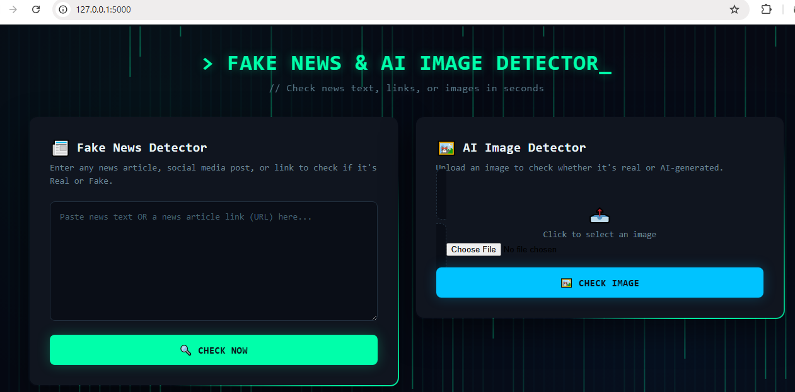
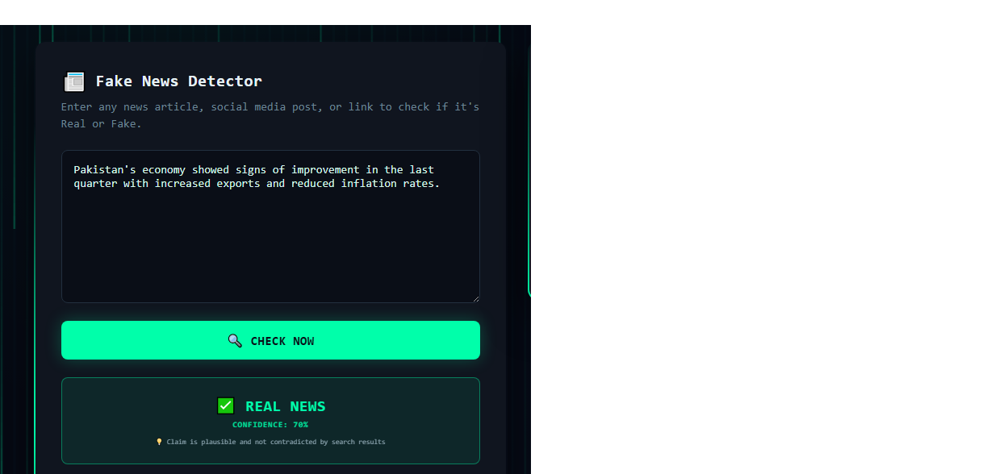
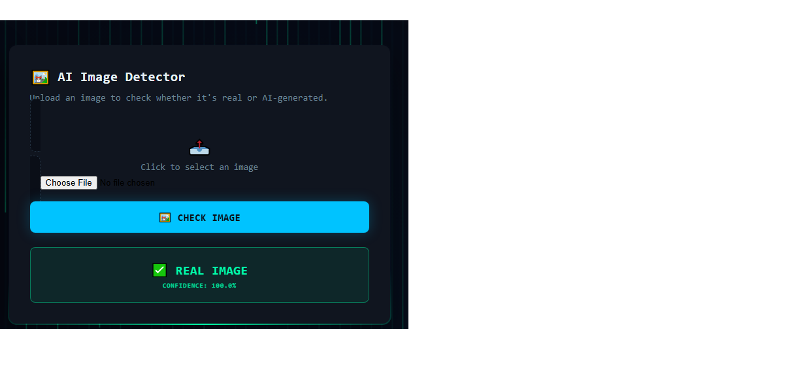

# 🔍 Fake News & AI Image Detector

An AI-powered web application that performs two tasks:
1. **Fake News Detection** — Enter any news text, social media post, or news article link to check whether it's REAL or FAKE.
2. **AI-Generated Image Detection** — Upload any image to detect whether it's a real photograph or AI-generated.

## ✨ Features

- 📰 Analyzes both plain news text and article URLs
- 🔎 Real-time fact-checking using Google Search (via SerpAPI)
- 🤖 Powered by Groq AI (LLM) for news analysis and confidence scoring
- 🖼️ Custom-trained deep learning model to detect AI-generated images
- 🎨 Modern, dark "hacker-style" UI with animated background
- 🔊 Sound feedback on submission

## 🛠️ Tech Stack

- **Backend:** Python, Flask
- **AI/ML:** Groq API (LLM), TensorFlow/Keras (image classification), SerpAPI (Google Search)
- **Frontend:** HTML, CSS, JavaScript
- **Web Scraping:** BeautifulSoup

## 🚀 Setup Instructions

1. Clone the repository:
'''
git clone https://github.com/Zaiba-Munir/Fake-News-image-Detector.git
cd Fake-News-image-Detector
'''
2. Install the required Python packages:

'''
pip install -r requirements.tx
'''

3. Create a `.env` file in the project folder and add your API keys:
'''
GROQ_API_KEY=your_groq_api_key_here
SERPAPI_KEY=your_serpapi_key_here
'''
4. Run the application:
'''
python app.py
'''
5. Open in your browser:
'''
http://127.0.0.1:5000

'''

## 📂 Project Structure
''' 
├── app.py # Main Flask application
├── train_model.py # Image detection model training script
├── model/ # Trained AI image detection model
├── dataset/ # Training dataset
├── templates/
│ └── index.html # Frontend UI                 
└── .gitignore
'''
### Real News Detection

### Fake News Detection

### Real Image Detection

### AI-Generated Image Detection

## 📸 Screenshots
### Reall news detection

### Fake News Detection

### Real Image Detection

### AI-Generated Image Detection

## ⚠️ Disclaimer

This project is built for educational and demonstration purposes. AI-based fake news detection is not guaranteed to be 100% accurate — always cross-check with multiple reliable sources.

## 👩‍💻 Author

**Zaiba Munir**
